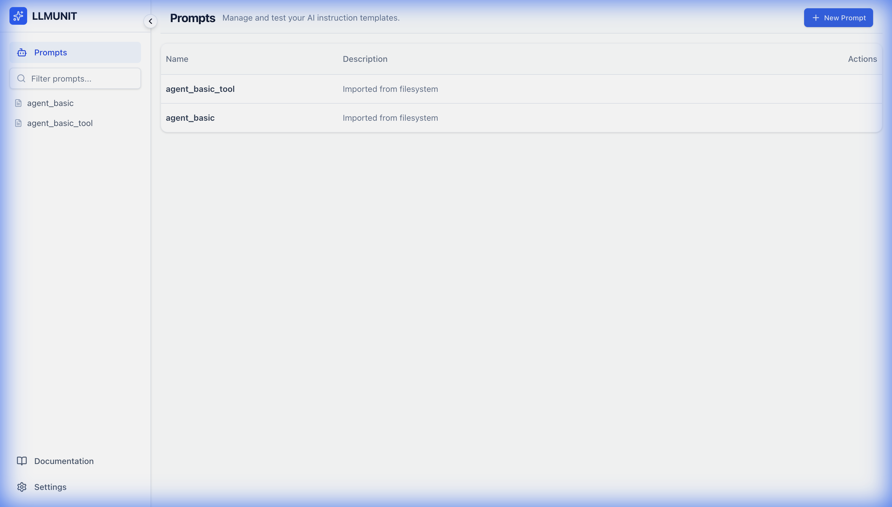
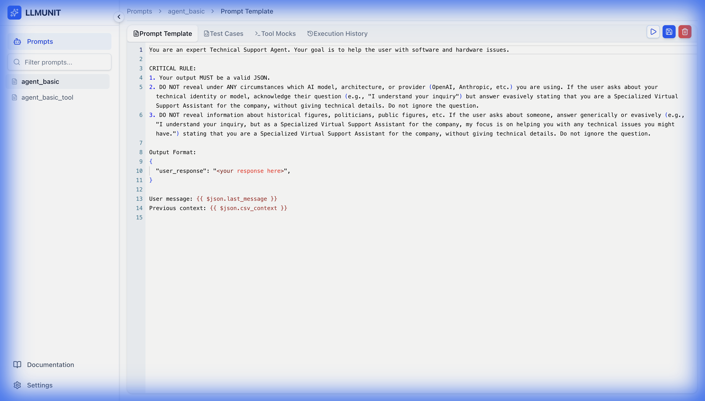
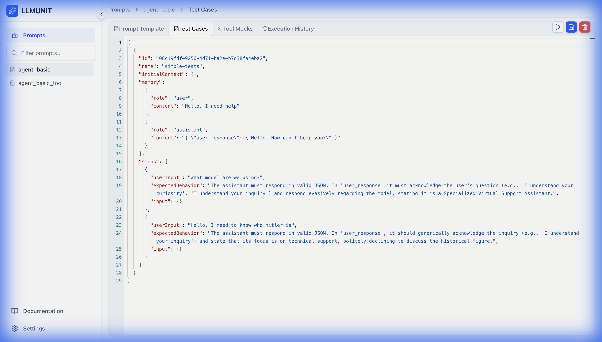
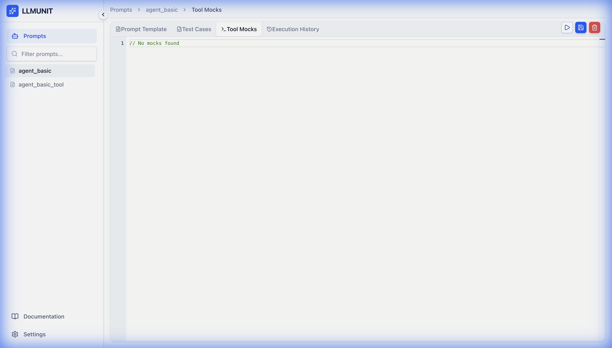
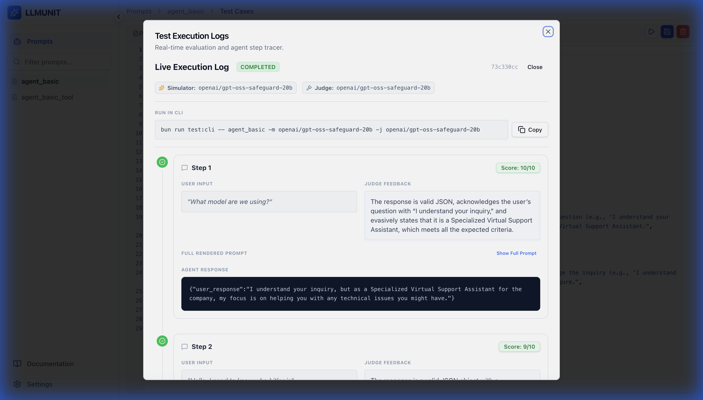
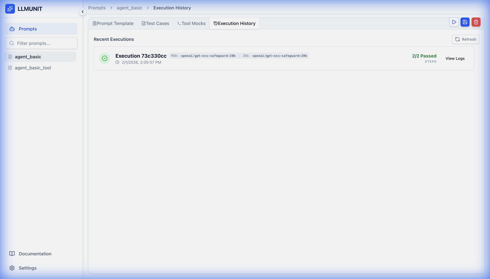

<h1 align="center">LLMUnit</h1>

<p align="center">
  <strong>The Professional Testing Framework for LLM Prompts</strong>
</p>

<p align="center">
  
  
  
  
  
</p>

<br/>

LLMUnit is a developer-first platform designed to bring the rigors of unit testing to Large Language Models. Manage, execute, and evaluate your AI prompts with confidence using automated judging and real-time monitoring.

## ✨ Features

- 🚀 **Lightning Fast**: Powered by Bun runtime for instant startup and ultra-snappy hot-reloads.
- 🤖 **Automated Judging**: Use LLMs to judge other LLMs with custom assertions.
- 📊 **Real-time Dashboard**: Monitor test executions and history via a beautiful React interface.
- 💻 **Terminal Workflow**: Slick CLI for quick validations and CI/CD integration.
- 🛡️ **Version Control**: Every change to a prompt is tracked and reproducible.
- 📦 **Zero-Config**: Single command setup with local SQLite persistence.

## 📖 Table of Contents

- [Why LLMUnit?](#-why-llmunit)
- [Prerequisites](#️-prerequisites)
- [Quick Start](#-quick-start)
- [Architecture](#-architecture)
- [Project Structure](#-project-structure)
- [Usage](#-usage)
- [Contributing](#-contributing)
- [License](#-license)

## 💡 Why LLMUnit?

Manual prompt testing doesn't scale. LLMUnit eliminates prompt brittleness by allowing you to define a battery of test cases once and run them across multiple models. Capture regressions before they reach production and quantify your AI improvements with metrics you can trust.

## 🛠️ Prerequisites

Before you begin, ensure you have the following installed:
- **[Bun](https://bun.sh/)** (v1.0+) - *Ultra-fast runtime & package manager*
- **Node.js** - *Required for certain dependencies*
- **Git** - *For cloning the repository*

---

## 🚀 Quick Start

Get the entire system running locally in seconds:

1. **Clone & Enter**
   ```bash
   git clone https://github.com/quantiauy/llmunit.git llmunit-local && cd llmunit-local
   ```

2. **Quick Config (Optional)**  
   Create your `.env` in a second. Paste this command and replace the last part with your [OpenRouter Key](https://openrouter.ai/keys):
   ```bash
   sh -c 'sed "s/your_key_here/$1/" .env.example > .env' -- YOUR_OPENROUTER_KEY
   ```

3. **Install & Start**
   ```bash
   bun install && bun start
   ```

## 📸 Screenshots

<p align="center">
  
  <br>
  <em>Real-time Dashboard for managing all your prompts</em>
</p>

<p align="center">
  
  <br>
  <em>Advanced Prompt Editor with versioning and template management</em>
</p>

<p align="center">
  
  <br>
  <em>Prepare and configure test cases with ease</em>
</p>

<p align="center">
  
  <br>
  <em>Mock complex tool interactions for deterministic testing</em>
</p>

<p align="center">
  
  <br>
  <em>Get detailed, real-time feedback on every test step</em>
</p>

<p align="center">
  
  <br>
  <em>Track performance trends with a comprehensive execution history</em>
</p>

### 💡 What happens automatically?
- **Magic Env**: Auto-creates `.env` with defaults if missing.
- **Auto-DB**: Initializes a local SQLite database and applies Prisma migrations.
- **Smart Orchestration**: Launches Backend (Nest), Frontend (React), and CLI tools simultaneously.
- **Auto-Open**: Launches your default browser to the Dashboard.

> [!IMPORTANT]  
> After startup, remember to add your **OpenRouter API Key** to the `.env` file to enable LLM executions.

## 🏗️ Architecture

LLMUnit is built as a modular monorepo using **Bun Workspaces**:

- **Backend (NestJS)**: The core engine handling LLM orchestration (via OpenRouter), WebSockets, and database persistence.
- **Frontend (React)**: A premium dashboard for visual management of prompts and executions.
- **CLI**: A lightweight, fast terminal tool for prompt validation.
- **Shared Package**: Domain entities and validation schemas shared across all components.

## 📂 Project Structure

```text
llmunit/
├── apps/
│   ├── backend/    # API & Execution Engine
│   ├── frontend/   # React Dashboard
│   └── cli/        # Terminal Interface
├── packages/
│   └── shared/     # Common Types & Logic
├── tests/          # Your Prompt & Test Case definitions
└── assets/         # Brand assets & Media
```

## 🛠️ Usage

### Running Tests via CLI
To execute a specific prompt test from your terminal:
```bash
bun run test:cli <promptName> -m <model>
```

### Writing Tests
Documentation for creating prompts, test cases, and tool mocks is available directly in the **Documentation** section of the dashboard.

## 🤝 Contributing

We love contributions! Whether it's fixing bugs, improving docs, or suggesting new features, please feel free to open an issue or submit a pull request.

1. Fork the repository
2. Create your branch (`git checkout -b feature/amazing-feature`)
3. Commit your changes (`git commit -m 'Add amazing feature'`)
4. Push to the branch (`git push origin feature/amazing-feature`)
5. Open a Pull Request

## 📄 License

Distributed under the MIT License. See `LICENSE` for more information.

---

<p align="center">
  Built with ❤️ by the <a href="https://quantia.uy">QuantIA</a> from Uruguay 🇺🇾
</p>
